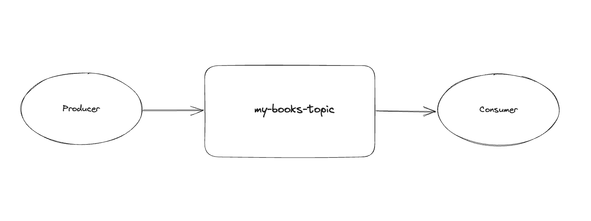
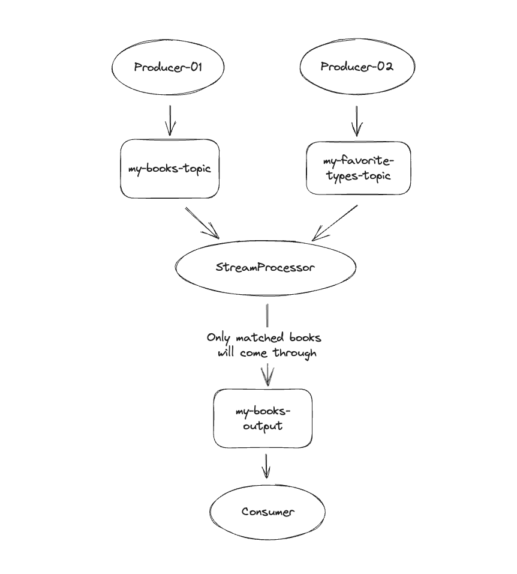

# My Kafka App

This is a scala app to test out basic kafka functions.

## Dev

start kafka

```shell
docker-compose up -d
```

### Kafka UI

```
http://localhost:8081
```

### Kafka Diagnosis

[here](./docs/Kafka-Diagnosis.md)


## Topics

### For Regular Events

- create a topic: `my-books-topic`

### For Streams

- create a output topic: `my-books-output`
- create a second source topic: `my-favorite-types-topic`
- create events which will be saved to `KTable`, e.g.

| KEY | VALUE |
| ---- | ---- |
| TECH | YES |
| NOVEL| YES |

### Running the my-consumer

```bash
cd my-consumer
```

```bash
sbt
```

Start the Event Consumer:

```bash
run EVENT
```

Start the Stream Consumer:
```bash
run STREAM
```

### Running the my-producer

```bash
cd my-producer
```

```bash
sbt run
```

## Event Consumer Arch



## Stream Consumer Arch


